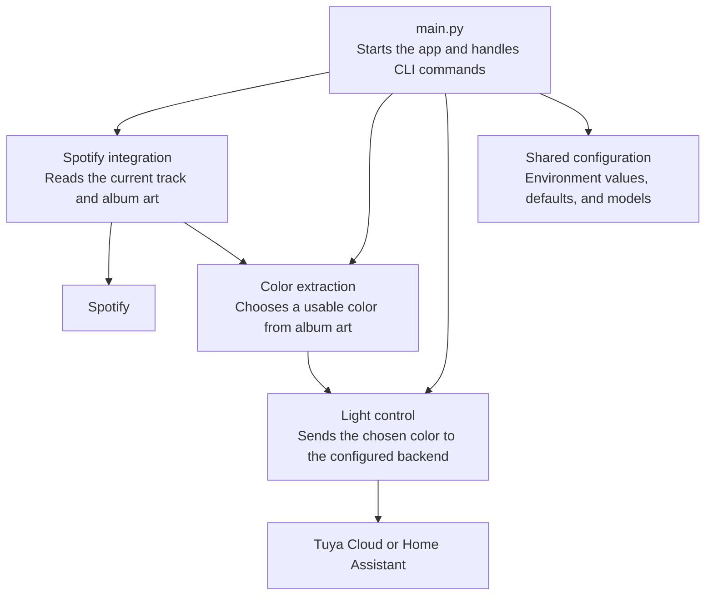

# Spotify Album Art Bulb Color

This script watches the currently playing Spotify track for your account and
sets one or more smart bulbs to album-art colors. Spotify's current-playback
API works whether playback is on the Mac Spotify app or on your Android phone,
as long as both use the same Spotify account.

## Setup

### 1. Local Python environment

Create and activate a virtual environment:

```sh
python3 -m venv .venv
source .venv/bin/activate
pip install -r requirements.txt
```

Copy the example config:

```sh
cp .env.example .env
```

### 2. Spotify Developer setup

The script uses Spotify's Web API with the Authorization Code with PKCE flow.
It needs only the app's public Client ID, not the Client Secret.

1. Go to `https://developer.spotify.com/dashboard` and log in.
2. Click `Create app`.
3. Use any app name and description, for example:

   ```text
   App name: Spotify Album Bulb
   App description: Sync bulb color to current Spotify album art
   ```

4. For `Which API/SDKs are you planning to use?`, select only:

   ```text
   Web API
   ```

   Do not select `Ads API`, `iOS`, `Android`, or `Web Playback SDK`.

5. Add this redirect URI exactly:

   ```text
   http://127.0.0.1:8888/callback
   ```

6. Create/save the app, then copy the app's `Client ID`.
7. Put it in `.env`:

   ```env
   SPOTIFY_CLIENT_ID=0123456789abcdef0123456789abcdef
   SPOTIFY_REDIRECT_URI=http://127.0.0.1:8888/callback
   POLL_SECONDS=1
   ```

Do not put your Spotify username, email, password, or Client Secret in
`SPOTIFY_CLIENT_ID`.

On first run, the script opens Spotify login in your browser and stores the
resulting refresh token in `.cache/spotify_token.json` with owner-only file
permissions.

### 3. Smart Life and Tuya Cloud setup

Use the Smart Life app as the mobile app for this bulb. The Wipro app can
control the bulb, but Tuya Cloud's account-link QR flow is designed for
Smart Life/Tuya-compatible app accounts.

1. Install `Smart Life` on Android.
2. Reset and pair the bulb in Smart Life.
3. Go to `https://platform.tuya.com/` and log in or create a Tuya Developer
   account.
4. In the left navigation, open `Cloud`.
5. Click `Create Cloud Project`.
6. Use these project settings:

   ```text
   Development Method: Smart Home
   Data Center: the data center matching your Smart Life account region
   ```

   To confirm the app account region in Smart Life, open:

   ```text
   Me -> Settings -> Account and Security -> Region
   ```

   For an India Smart Life account, use `India Data Center` and:

   ```env
   TUYA_ENDPOINT=https://openapi.tuyain.com
   ```

7. Authorize these API services when prompted:

   ```text
   Industry Basic Service
   Smart Home Basic Service
   Device Status Notification
   ```

8. Open the new cloud project's `Overview` page. Under `Authorization Key`,
   copy:

   ```env
   TUYA_ACCESS_ID=<Access ID>
   TUYA_ACCESS_SECRET=<Access Secret>
   ```

   Do not use the Project ID here.

9. Link Smart Life devices to the cloud project:

   ```text
   Cloud project -> Devices -> Link Tuya App Account -> Add App Account
   ```

10. Scan the QR code with the Smart Life app and confirm the link in the app.
11. In Tuya Cloud, open:

    ```text
    Cloud project -> Devices -> All Devices
    ```

12. Find the bulb and copy its `Device ID` into `.env`:

    ```env
    TUYA_DEVICE_ID=<bulb device id>
    ```

    For multiple bulbs, use a comma-separated list instead:

    ```env
    TUYA_DEVICE_IDS=<first bulb device id>,<second bulb device id>
    TUYA_DEVICE_LABELS=desk bulb,floor bulb
    ```

Your Tuya config should look like:

```env
LIGHT_BACKEND=tuya_cloud
TUYA_ENDPOINT=https://openapi.tuyain.com
TUYA_ACCESS_ID=<cloud project access id>
TUYA_ACCESS_SECRET=<cloud project access secret>
TUYA_DEVICE_IDS=<first bulb device id>,<second bulb device id>
TUYA_DEVICE_LABELS=desk bulb,floor bulb
TUYA_ENSURE_ON_COLOR_MODE=false
```

Common Tuya endpoints:

```text
China Data Center: https://openapi.tuyacn.com
Western America Data Center: https://openapi.tuyaus.com
Eastern America Data Center: https://openapi-ueaz.tuyaus.com
Central Europe Data Center: https://openapi.tuyaeu.com
Western Europe Data Center: https://openapi-weaz.tuyaeu.com
India Data Center: https://openapi.tuyain.com
Singapore Data Center: https://openapi-sg.iotbing.com
```

### 4. Backend choice

Configure one light backend:

- `LIGHT_BACKEND=tuya_cloud`: requires a Tuya IoT Cloud project, the cloud
  `Access ID`, `Access Secret`, and the bulb `Device ID`. Pairing the bulb in
  Smart Life and linking that app account to Tuya Cloud is the recommended path
  for this bulb.
- `LIGHT_BACKEND=homeassistant`: requires the bulb to already be exposed as a
  Home Assistant `light.*` entity and a Home Assistant long-lived access token.

### 5. Validate credentials

Check Spotify and album-art color extraction without touching the bulb:

```sh
python main.py --dry-run-once
```

Test direct bulb control:

```sh
python main.py --set-rgb '#00aaff'
```

## Run

Test Spotify and color extraction without changing the bulb:

```sh
python main.py --dry-run-once
```

Run continuously:

```sh
python main.py
```

By default, Spotify is polled every 1 second. If Spotify returns a rate-limit
response, the script sleeps for Spotify's `Retry-After` value before polling
again. Tune the normal polling interval in `.env`:

```env
POLL_SECONDS=1
```

The polling interval must be greater than `0`.

By default, configured bulbs receive different colors from the same album art:

```env
LIGHT_COLOR_MODE=album_palette
```

To send the same dominant album-art color to every configured bulb, set:

```env
LIGHT_COLOR_MODE=same
```

If `TUYA_DEVICE_IDS` is set, every listed Tuya device is updated. If it is not
set, the script falls back to the single-bulb `TUYA_DEVICE_ID` setting.
Set `TUYA_DEVICE_LABELS` to control the names shown in logs. The label count
must match the number of configured Tuya devices.

The script ignores album-art colors that are too dark or gray to produce useful
bulb output. If no usable color is found, it uses a fallback color. Tune that in
`.env`:

```env
ALBUM_COLOR_MIN_LUMINANCE=0.08
ALBUM_COLOR_MIN_SATURATION=0.12
ALBUM_COLOR_FALLBACK=#ff6600
```

This bulb advertises Tuya `control_data` with a native `gradient` mode, but in
testing it accepted that command without changing color. The script therefore
uses the reliable direct color command, `colour_data_v2`, for each song change.
By default it sends only the color command, which is faster when the bulb is
already on and already in color mode. If color changes stop applying after you
manually switch the bulb to another mode, set this in `.env`:

```env
TUYA_ENSURE_ON_COLOR_MODE=true
```

Set a manual color to test bulb control:

```sh
python main.py --set-rgb '#00aaff'
```

On the first run, the script opens Spotify login in your browser and stores a
refresh token under `.cache/spotify_token.json` with owner-only file
permissions. If the browser callback never arrives, Spotify authorization times
out instead of blocking forever.

## Architecture

### Runtime flow

The app starts in `main.py`.

1. It builds the CLI parser and parses flags such as `--dry-run-once` and
   `--set-rgb`.
2. It loads `.env` values with `load_dotenv()` and resolves environment-backed
   defaults such as `POLL_SECONDS`.
3. It validates runtime options, including requiring `POLL_SECONDS` to be
   greater than `0`.
4. For direct actions:
   - `--set-rgb` sends a manual RGB color to the configured light backend.
5. For normal watcher mode:
   - `build_spotify()` creates the Spotify client.
   - `build_light_controller()` creates the configured light backend unless
     `--dry-run-once` is enabled.
   - `run_watcher()` polls Spotify, resolves album-art color only when the
     track changes, and updates the bulb.

### Architecture diagram



### Module layout

#### `main.py`

CLI entrypoint. It owns argument parsing, top-level control flow, and
configuration error handling.

#### `src/config.py`

Environment and configuration helpers:

- `.env` loading
- required/optional environment lookup
- boolean and float parsing
- Spotify Client ID validation

This keeps config parsing out of the feature modules.

#### `src/constants.py`

Shared string and numeric defaults used across the project, such as Spotify
URLs, default polling interval, and default fallback color.

#### `src/models.py`

Shared application models:

- `Color`: RGB tuple alias used across the project
- `TrackSummary`: normalized track metadata used by the runner
- `TrackColor`: track identity plus resolved RGB color

#### `src/runner.py`

Application orchestration logic. This is the main runtime layer between
Spotify, album-art color extraction, and the light backend.

Key responsibilities:

- get the current Spotify track
- normalize playback data into `TrackSummary`
- resolve album art into `TrackColor`
- avoid duplicate album-art extraction and light updates when the track has not
  changed
- handle dry-run behavior
- keep the watcher alive across transient runtime failures
- back off on Spotify rate limits

#### `src/color/`

Color extraction and conversion logic.

- `src/color/utils.py`
  - RGB parsing and formatting
  - luminance and saturation helpers
  - RGB to HSV command conversion for Tuya
- `src/color/extractor.py`
  - fetch image bytes from album-art URLs
  - quantize artwork colors
  - filter unusable colors
  - apply fallback color when needed

This package is intentionally pure or close to pure except for image download.

#### `src/spotify/`

Spotify integration.

- `src/spotify/factory.py`
  - validates required Spotify config
  - builds a `SpotifyClient`
- `src/spotify/client.py`
  - PKCE authorization flow
  - token caching and refresh
  - Spotify Web API calls
  - shared JSON request helper
  - rate-limit parsing

This package is the only place that should know the details of Spotify auth
and API request structure.

#### `src/light/`

Light backend abstraction and implementations.

- `src/light/base.py`
  - `LightController` protocol used by the runner
- `src/light/factory.py`
  - selects the configured backend
- `src/light/tuya.py`
  - Tuya signing and API client
  - Tuya device specification inference
  - Tuya light controller implementation
- `src/light/homeassistant.py`
  - Home Assistant light controller implementation

The runner depends only on the `LightController` interface, so backend-specific
behavior stays isolated inside this package.

#### `src/__init__.py` and package `__init__.py` files

These re-export commonly used symbols so imports stay short and consistent.

### Design intent

The refactor separates the codebase into layers with clear responsibilities:

- `main.py` handles process startup and CLI behavior.
- `runner.py` handles application flow.
- `spotify/` handles Spotify communication.
- `color/` handles album-art color extraction and color math.
- `light/` handles output backends.
- `config.py`, `constants.py`, and `models.py` hold shared cross-cutting
  pieces.

That split makes future changes more local. For example:

- adding another light backend should mostly stay inside `src/light/`
- changing Spotify auth or caching should stay inside `src/spotify/`
- tuning album-art extraction should stay inside `src/color/`
- adding new CLI commands should mostly stay in `main.py`

### Extension points

The main places to extend the app are:

- new light backend:
  - add a controller in `src/light/`
  - update `build_light_controller()`
- new color policy:
  - update `src/color/extractor.py` or `src/color/utils.py`
- new Spotify behavior:
  - extend `SpotifyClient` or the runner helpers
- new commands:
  - add CLI flags in `main.py`
  - route them into existing modules instead of adding feature logic directly
    to the entrypoint

## Tests

Run the test suite from the project virtual environment:

```sh
.venv/bin/python -m pytest tests
```

Current test coverage is offline-only and does not require Spotify or Tuya
credentials. It covers:

- color parsing, filtering, HSV conversion, and album-art fallback behavior
- config parsing and Spotify client ID validation
- Spotify helper behavior such as retry parsing, token persistence, request
  error handling, refresh-on-401 flow, rate-limit handling, private token-cache
  writes, and OAuth callback timeout/cleanup
- runner dry-run-once behavior, invalid playback payloads, and unchanged-track
  skipping
- CLI behavior for manual RGB commands, malformed user input, and invalid
  polling intervals
- light backend factory selection
- Tuya spec inference and Tuya command payload generation

## Notes

If the Wipro Next Smart Home app cannot be linked to a Tuya IoT project, direct
Tuya Cloud control will not work even if the bulb is Tuya-based internally. In
that case, expose the bulb through Home Assistant and use the `homeassistant`
backend.

## Reference Docs

- [Spotify app setup and Client ID](https://developer.spotify.com/documentation/web-api/concepts/apps)
- [Spotify PKCE authorization flow](https://developer.spotify.com/documentation/web-api/tutorials/code-pkce-flow)
- [Tuya Smart Home cloud project and Smart Life account linking](https://developer.tuya.com/en/docs/iot/Platform_Configuration_smarthome?id=Kamcgamwoevrx)
- [Tuya cloud endpoints by data center](https://developer.tuya.com/en/docs/iot/api-request?id=Ka4a8uuo1j4t4)
