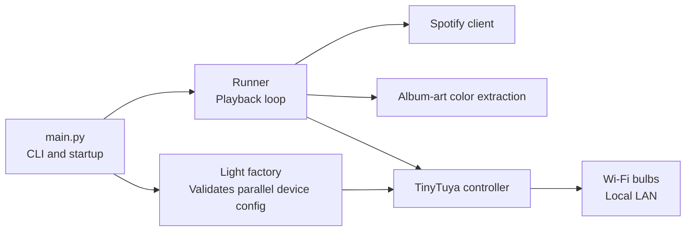

# Spotify Album Art Bulb Color

This app watches the currently playing Spotify track and sets one or more
Tuya-compatible Wi-Fi bulbs to colors from the album art. Bulb commands travel
directly from the Mac to each bulb over the local network through TinyTuya;
Home Assistant, a REST gateway, and the Tuya Cloud API are not runtime
dependencies.

## Setup

### 1. Create the Python environment

From the repository root:

```sh
python3 -m venv .venv
source .venv/bin/activate
python -m pip install -r requirements.txt
cp .env.example .env
```

TinyTuya is installed by `requirements.txt`. The real `.env` is ignored by Git
and must remain local.

### 2. Configure Spotify

The app uses Spotify's Web API with Authorization Code with PKCE. It needs the
public Client ID, not a Client Secret.

1. Sign in at [Spotify for Developers](https://developer.spotify.com/dashboard).
2. Create an app and select `Web API`.
3. Add this redirect URI exactly:

   ```text
   http://127.0.0.1:8888/callback
   ```

4. Copy the app's 32-character Client ID into `.env`:

   ```env
   SPOTIFY_CLIENT_ID=0123456789abcdef0123456789abcdef
   ```

Do not use a Spotify username, email, password, or Client Secret. On first run,
the app opens Spotify login in a browser and stores the refresh token in
`.cache/spotify_token.json` with owner-only permissions.

### 3. Pair the bulbs

Pair each bulb with the Smart Life app and leave it powered on. The bulbs and
the Mac must be on the same non-guest LAN. Client isolation, guest networks,
and some restrictive firewall rules prevent local device control.

Do not reset or re-pair a bulb after collecting its local key. Re-pairing
usually changes the key and invalidates the saved configuration.

### 4. Discover device IDs, IPs, and protocol versions

Run TinyTuya discovery:

```sh
python -m tinytuya scan
```

If broadcast discovery finds nothing, use the router's connected-device or
DHCP-client page to identify the bulb IP addresses. TinyTuya's forced scan
requires the device IDs and local keys from `devices.json`, so it cannot replace
the wizard during initial setup. After completing the wizard, force-scan the
Mac's actual LAN subnet if needed, for example:

```sh
python -m tinytuya scan -force 192.168.1.0/24 -no-broadcasts
```

Replace the example subnet with yours. Record each device ID, IP address, and
protocol version together. Create DHCP reservations for the bulbs in the
router so their configured IP addresses remain stable.

TinyTuya discovery uses UDP ports 6666, 6667, and 7000 and local device traffic
uses TCP port 6668. The router's connected-device page can help identify IP
addresses, but it does not provide local keys.

### 5. Obtain local keys

A LAN scan cannot derive a bulb's local key. First check whether you have a
trusted backup of a TinyTuya `devices.json` created while the bulbs were paired
in their current state. Match its `id` and `key` fields to each bulb.

If you do not have valid saved keys, use TinyTuya's wizard as a one-time
provisioning step. It may require temporary access to an authorized Tuya IoT
developer project linked to the same Smart Life account:

```sh
python -m tinytuya wizard
```

Enter the Tuya project Access ID and Access Secret only at the interactive
prompts, select the correct API region, and provide one known device ID. Do not
place credentials on a command line or copy them into tracked files. Once the
local keys have been obtained, normal app operation does not call the Tuya
Cloud API.

If neither an existing valid key nor wizard access is available, stock
TinyTuya cannot control the bulb locally. Do not guess keys.

### 6. Protect generated device credentials

The repository ignores these root-level TinyTuya artifacts:

```text
devices.json
tinytuya.json
tuya-raw.json
snapshot.json
```

Before and after running the wizard, verify the rules:

```sh
git check-ignore -v .env devices.json tinytuya.json tuya-raw.json snapshot.json
git status --short
```

Never use `git add -f` on those files. Restrict the permissions of sensitive
files that exist:

```sh
chmod 600 .env
find . -maxdepth 1 -type f \
  \( -name devices.json -o -name tinytuya.json -o \
     -name tuya-raw.json -o -name snapshot.json \) \
  -exec chmod 600 {} +
```

After local control works, the generated JSON files can be moved to encrypted
storage or deleted. The runtime reads device settings from `.env`, not from
those files.

### 7. Configure local devices

Add one comma-separated value per bulb to `.env`. All required lists must have
the same length and identical device ordering:

```env
TUYA_DEVICE_IDS=first_device_id,second_device_id
TUYA_DEVICE_IPS=192.168.1.101,192.168.1.102
TUYA_LOCAL_KEYS=first_local_key,second_local_key
TUYA_PROTOCOL_VERSIONS=3.3,3.3
TUYA_DEVICE_LABELS=desk bulb,floor bulb
```

Local keys contain exactly 16 characters. The application's `.env` loader
treats `#` as data after the `=`, so it does not need escaping. Existing files
that single-quote the entire comma-separated value remain supported:

```env
TUYA_LOCAL_KEYS='abc#defghijklmno,1234567890abcdef'
```

Do not add a backslash before `#`; it would become part of the key. Lists use
CSV syntax, so an individual value containing a comma can instead be wrapped
in double quotes; represent a literal double quote within that field as `""`.

`TUYA_DEVICE_LABELS` is optional. If omitted, the app uses `bulb 1`, `bulb 2`,
and so on. Supported protocol versions are 3.1 through 3.5. Each device ID, IP,
key, and version must describe the same physical bulb at the same list index.

The former `TUYA_ACCESS_ID`, `TUYA_ACCESS_SECRET`, and singular
`TUYA_DEVICE_ID` variables are not used.

### 8. Verify the setup

If the wizard generated `devices.json`, TinyTuya can optionally try to poll it:

```sh
python -m tinytuya devices
```

This diagnostic command does not read the application's `.env`. If local
broadcast discovery is blocked and `devices.json` has no recorded IPs, it may
report `No IP found - Battery-powered or offline` even for powered, reachable
bulbs. Successful application commands using the configured IPs are the
authoritative local-control test.

Then test the application in this order:

```sh
python main.py --dry-run-once
python main.py --set-rgb '#00aaff'
python main.py --switch
python main.py --auto-switch
```

If a bulb fails, confirm that it is powered, its IP is reachable from the Mac,
the router has not reassigned the address, and the ID/key/version were copied
from the same device. Also confirm the bulb has not been reset or re-paired
since the key was collected.

## Run

Process the current Spotify track once without changing any bulbs:

```sh
python main.py --dry-run-once
```

Continuously follow the current track:

```sh
python main.py
```

Switch bulbs on at startup and off during normal or `CTRL+C` shutdown:

```sh
python main.py --auto-switch
```

Set a manual color or toggle every configured bulb:

```sh
python main.py --set-rgb '#00aaff'
python main.py --switch
```

The app polls Spotify at a fixed internal interval. It extracts an ordered
album-art palette with `colorgram.py`, skips colors that are too close to
black when possible, and prefers distinct hues for multiple bulbs. Before
sending a color through TinyTuya, the app applies its HSV brightness and
saturation policy so local control retains the visual behavior of the former
backend.

Automatic shutdown switching is best effort. It cannot run if the process is
force-killed, the Mac sleeps, or a bulb is unreachable.

## Migrating to a different router or Wi-Fi

TinyTuya communicates with the bulbs by local IP address, while the router
assigns those addresses using DHCP. A DHCP reservation binds a bulb's Wi-Fi MAC
address to a predictable local IP so the `.env` configuration continues to
work after lease renewals and restarts. Reservations belong to the router and
must be recreated when the router is replaced.

Changing internet providers requires no application changes when the existing
router, Wi-Fi settings, and LAN remain unchanged. Replacing the router or
changing the Wi-Fi credentials requires one of the following migrations.

### New router with the same Wi-Fi name and password

1. Configure the new router with the old SSID, password, and a bulb-compatible
   security mode such as WPA2 or WPA2/WPA3 mixed.
2. If practical, reuse the old LAN subnet. Otherwise, find each bulb in the new
   router's connected-device list by its MAC address.
3. Recreate a DHCP reservation for every bulb. The reserved address must belong
   to the new router's LAN and must not conflict with another device.
4. Update `TUYA_DEVICE_IPS` if any reserved addresses changed. Device IDs,
   local keys, and protocol versions normally remain valid because the bulbs
   were not reset or re-paired.
5. Run the local verification commands below.

### New Wi-Fi name or password

A bulb cannot join a network whose credentials it does not know. If Smart Life
cannot update the network without removing the device, plan to reset and
re-pair it. Re-pairing normally changes the local key and may change other
device metadata.

Before changing networks:

1. Keep an encrypted backup of the working `.env` or separately record the
   device order, labels, and protocol versions.
2. Record each bulb's Wi-Fi MAC address. Do not put real IDs, local keys, MAC
   addresses, or network credentials in this README or another tracked file.
3. If retaining `devices.json`, store it in an encrypted location outside the
   repository. Renaming it inside the repository is unsafe because only the
   expected root filenames are ignored.

On the new network:

1. Enable a compatible 2.4 GHz Wi-Fi network and connect the phone running
   Smart Life to it.
2. Reset and pair each bulb in Smart Life when required. Keep a clear mapping
   between each physical bulb and its label.
3. Confirm that `.env` and all TinyTuya-generated credential filenames remain
   ignored, then run `python -m tinytuya wizard` again to retrieve the current
   device IDs and local keys. This may require temporary authorization for a
   Tuya IoT developer project; normal application runtime remains cloud-free.
4. Find the bulbs in the new router's connected-device list. Broadcast
   discovery is optional and may not work on every router.
5. Create DHCP reservations for the new bulb addresses using their MAC
   addresses.
6. Determine or verify each protocol version. If the keyed force scan is
   needed, run it only after the wizard has created the new `devices.json`:

   ```sh
   python -m tinytuya scan -force 192.168.1.0/24 -no-broadcasts
   ```

7. Replace the device IDs, IPs, local keys, and protocol versions in `.env`.
   Preserve identical device ordering across every comma-separated list and
   quote the full local-key value when necessary.
8. Reapply owner-only permissions:

   ```sh
   chmod 600 .env devices.json tinytuya.json tuya-raw.json snapshot.json
   ```

   Omit filenames that were not generated.

9. Verify the migrated setup:

   ```sh
   python main.py --set-rgb '#00aaff'
   python main.py --switch
   python main.py --auto-switch
   ```

After successful verification, remove obsolete cloud variables from `.env` and
securely archive or delete cloud-generated JSON files that are no longer
needed. Do not reset or re-pair a working bulb merely because TinyTuya's
standalone discovery command cannot find its IP; explicit-IP application
control is sufficient.

## Architecture



The important modules are:

- `main.py`: CLI parsing, top-level flow, and user-facing error handling.
- `src/runner.py`: Spotify polling, track-change detection, color selection,
  retries, and automatic power behavior.
- `src/spotify/`: PKCE authorization, token storage and refresh, and Spotify
  API requests.
- `src/color/`: image download, visible palette extraction, RGB/HSV policy, and
  multi-bulb palette selection.
- `src/light/base.py`: single/group light-control interfaces.
- `src/light/factory.py`: validates the required parallel TinyTuya settings and
  creates one local controller per bulb.
- `src/light/tiny_tuya.py`: configures `tinytuya.BulbDevice` and performs local
  RGB, power, state, and toggle operations.
- `src/light/constants.py` and `src/light/enums.py`: supported protocol versions
  and TinyTuya environment-variable names.

The runner depends only on the light-control interface, keeping the TinyTuya
implementation isolated from Spotify and color extraction.

## Tests

Run the offline test suite from the repository root:

```sh
PYTHONPATH=. .venv/bin/python -m pytest tests
```

Tests mock TinyTuya devices, so they do not contact bulbs or need real keys.
They cover configuration validation, controller construction, RGB and power
commands, state-based toggling, local-key redaction, group behavior, Spotify
authorization/request helpers, album-art extraction, runner behavior, and CLI
validation.

The automated suite does not prove live connectivity. Complete the manual
`--set-rgb`, `--switch`, and `--auto-switch` checks on the same LAN as the
bulbs.

## Security notes

- Treat `TUYA_LOCAL_KEYS` like passwords.
- Never commit `.env` or TinyTuya-generated JSON files.
- Do not paste keys into logs, issues, pull requests, screenshots, or chat.
- Prefer DHCP reservations to repeatedly editing IP addresses.
- Keep IoT devices on a trusted local network with only the connectivity they
  require.

## Reference docs

- [TinyTuya repository and setup guide](https://github.com/jasonacox/tinytuya)
- [TinyTuya device API](https://github.com/jasonacox/tinytuya#bulbdevice)
- [Spotify app setup](https://developer.spotify.com/documentation/web-api/concepts/apps)
- [Spotify PKCE authorization](https://developer.spotify.com/documentation/web-api/tutorials/code-pkce-flow)
